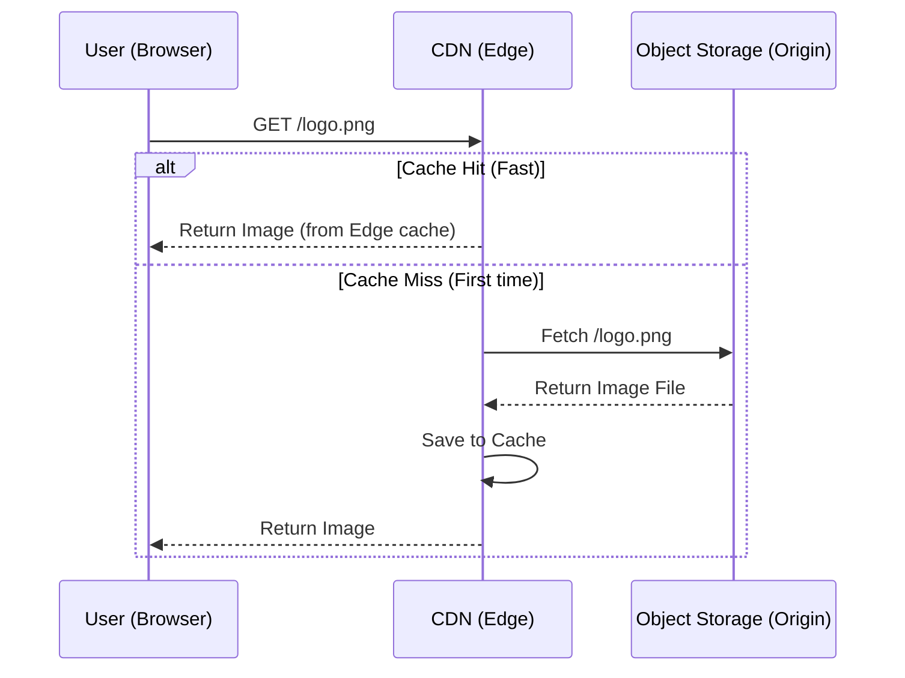

# Object Storage (The "Blob" Store)

## 1. The Problem with Databases
Databases (like Postgres or MySQL) are designed for structured text and numbers. They are **not** efficient at storing large binary files (images, videos, PDFs), often called **BLOBs** (Binary Large Objects).

*   **Performance Cost:** Storing a 5MB image in a database row slows down backups, queries, and migrations.
*   **Cost:** Database storage is typically much more expensive per GB than file storage.

## 2. The Solution: Object Storage
Instead of the database, we use specialized "Object Storage" services. These are essentially infinite hard drives in the cloud.

*   **Common Providers:**
    *   **AWS S3** (Simple Storage Service) - The industry standard.
    *   **Google Cloud Storage** (GCS).
    *   **R2** (Cloudflare) - Competitor with zero egress fees.
    *   **UploadThing** - A wrapper around S3 specifically for Next.js apps.

## 3. The Architecture Pattern
We do not save the file in the database. We save the **Reference** (Link).

1.  **Upload:** The user uploads `profile.jpg` to AWS S3.
2.  **Address:** S3 provides a URL: `https://my-bucket.s3.amazonaws.com/profile.jpg`.
3.  **Persist:** We save that URL string in our Postgres database in the `users` table.

```typescript
// Database Record (User)
{
  id: 123,
  name: "Alice",
  avatarUrl: "https://my-bucket.s3.amazonaws.com/u/123/avatar.jpg" // <--- The Link
}
```

## 4. Security (Presigned URLs)
To prevent public uploads, we often use **Presigned URLs**. The server generates a temporary, secure URL that allows the browser to upload *directly* to S3 for a short window (e.g., 5 minutes), bypassing the backend server to save bandwidth.
```

#### **2. New File: CDN & Delivery.md**

```diff
# CDN & Asset Delivery

Once a file is stored in Object Storage (S3), we rarely serve it directly from S3 to the user. S3 is slow for global delivery and charges for "egress" (bandwidth). Instead, we put a **CDN** (Content Delivery Network) in front of it.

## 1. How it Works
A CDN (like Cloudflare or AWS CloudFront) copies your assets to servers located physically close to the user (the "Edge").

### Sequence Diagram: Asset Retrieval



## 2. Image Optimization
Modern frameworks like Next.js (via the `<Image />` component) often integrate with the CDN to optimize images on the fly.
*   **Resizing:** If the user is on a phone, serve a 300px image, not the original 4000px upload.
*   **Formatting:** Convert JPEGs to **WebP** or **AVIF** (smaller file sizes) automatically if the browser supports it.
```

#### **3. Cleanup: Deleting Redundant Files**

```diff
