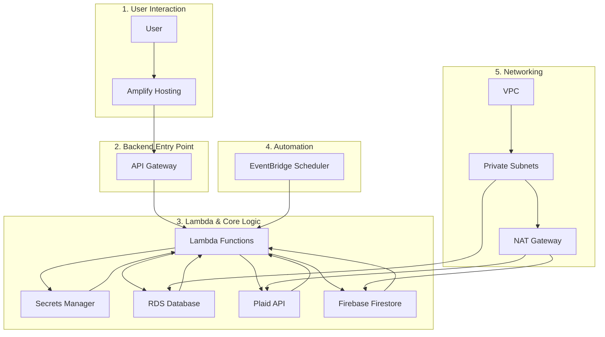

The user interacts with the UI that is hosted by amplify. 
We used API Gateway to create an api that our frontend hits.
what triggers this api call? 
This API Gateway triggers a lamda function.
The lamda function does various things: 
* accesses secrets manager for passwords
* RDS database for? 
* Plaid API to collect transactions
* Firebase Firestone for? 

We also have a VPC running
This host private subnets that point to the database
It also hosts a NAT gateway that points to Plaid API and Firebase firestore.

