# ==================================


==================================
 FILE: ./01.Knowledge_base/2.Hosting_nextjs.md 
==================================
AWS Tutorial: Deploying a Next.js App with Amplify, Route 53, and CloudFront
Deploying Your App: A Step-by-Step Guide
	1	Purchase a Domain:
	◦	Choose a domain registrar (e.g., Route 53, GoDaddy, Namecheap) and register your desired domain name (e.g., www.mycoolapp.com). This is your unique address on the internet.
	2	Create a Hosted Zone:
	◦	In Route 53, create a hosted zone for your domain. This will generate NS records that point to Route 53's name servers.
	◦	Explanation: A hosted zone is like a container that holds all the DNS records for your domain. These records tell the internet how to find your app.
	3	Connect Hosted Zone to Domain:
	◦	Copy the NS records from your hosted zone and paste them into your domain registrar's settings.
	◦	Explanation: This step delegates authority to Route 53 for managing your domain's DNS. It tells the internet to look at your Route 53 hosted zone for information about your domain.
	4	Deploy Your App via GitHub to Amplify:
	◦	Connect your GitHub repository to AWS Amplify.
	◦	Configure Amplify to build and deploy your app from your GitHub repo. This will create a unique Amplify app URL (e.g., https://main.d123456789abcdef0.amplifyapp.com).
	◦	Explanation: Amplify automatically builds and deploys your app whenever you push code changes to your repository. It also creates a CloudFront distribution to deliver your app's content globally.
	5	Create an Alias Record and SSL Configuration in Amplify:
	◦	In the Amplify console, add your custom domain (e.g., www.mycoolapp.com).
	◦	Amplify will guide you through creating an Alias record in your Route 53 hosted zone to point your domain to your app's CloudFront distribution.
	◦	Amplify will automatically provision and manage an SSL certificate for your custom domain, ensuring secure HTTPS connections.
	◦	Explanation: This step connects your custom domain to your Amplify app and enables secure communication between your users and your app.
Additional Considerations:
	•	Testing: After completing these steps, test your custom domain to ensure it's working correctly and your app is accessible via HTTPS.
	•	DNS Propagation: It may take some time for DNS changes to propagate across the internet, so be patient.
	•	Subdomains: You can also configure subdomains (e.g., blog.mycoolapp.com) within your hosted zone to point to different parts of your app or other resources.
This revised outline provides a more comprehensive guide to deploying your app with a custom domain, incorporating detailed explanations and additional considerations for a smoother and more successful deployment process.


Route 53
Route 53 acts as both a domain registrar and a DNS provider:
	•	Domain Registrar: This is where you register and manage your domain name (e.g., www.mycoolsite.com). It's like reserving your unique address on the internet.
	•	DNS Provider: Route 53 stores your domain's DNS records in a hosted zone. These records are the instructions that tell the internet how to find your website or application. Think of the hosted zone as a container holding all the DNS records for your domain.
Connecting Your Domain and Hosted Zone 
	1	Create a Hosted Zone: When you create a hosted zone in Route 53, it automatically generates:
	◦	NS (Name Server) Records: These records specify the name servers responsible for your domain's DNS information. They tell other DNS servers where to go to find the information needed to resolve your domain name.
	◦	SOA (Start of Authority) Record: This record identifies the authoritative name server for your domain and includes administrative details like the domain administrator's email address and the serial number of the zone file.
	2	Copy NS Records: Copy the NS records from your hosted zone.
	3	Update Domain Registrar: Go to your domain registrar (if it's not Route 53) and update the NS records for your domain to match the ones from your hosted zone. This delegates authority to Route 53 for managing your domain's DNS.
Types of DNS Records
	•	A Record: Maps a domain name to an IPv4 address.
	•	AAAA Record: Maps a domain name to an IPv6 address.
	•	CNAME Record: Creates an alias for an existing domain name. For example, www.mycoolsite.com could be a CNAME pointing to mycoolsite.com.
	•	Alias Record: A special type of record used in Route 53 to point your domain to AWS resources like CloudFront distributions, Elastic Load Balancers, or S3 buckets.
Amplify
Amplify simplifies the process of building, deploying, and hosting web applications:
	1	GitHub Integration: Connect your GitHub repository to Amplify.
	2	Automated Builds & Deploys: Amplify automatically builds and deploys your Next.js app whenever you push code changes to your repository.
	3	Hosting Environment: Amplify creates a hosting environment for your app, which is accessible through a unique Amplify app URL (e.g., https://main.d123456789abcdef0.amplifyapp.com). This URL acts as a user-friendly alias for the CloudFront distribution.
	4	CloudFront Integration: Amplify automatically creates a CloudFront distribution to deliver your app's content globally. CloudFront manages IP addresses across its edge locations and routes user requests to the nearest location for optimal performance.
	5	Route 53 Configuration: Amplify helps you configure Route 53 by creating an Alias record in your hosted zone that points your domain name to your CloudFront distribution.
CloudFront
CloudFront is a content delivery network (CDN) that:
	•	Distributes Content: Takes your app's files and distributes them to servers (edge locations) all over the world, improving website performance and reducing latency for users.
	•	Manages IP Addresses: Handles the complexities of managing IP addresses across its edge locations.
	•	Provides Security: Offers features like SSL/TLS encryption and DDoS protection.
Connecting Amplify to a Custom Domain in Route 53
	1	Add Domain in Amplify: Go to your Amplify app in the AWS console and add your custom domain in the "Domain management" section.
	2	Create Alias Record: Amplify will prompt you to create an Alias record in your Route 53 hosted zone, pointing your domain name to your Amplify app's CloudFront distribution.
	3	SSL Configuration: Amplify automatically provisions and manages an SSL certificate for your custom domain through AWS Certificate Manager (ACM), ensuring secure HTTPS connections.
SSL Connections
Amplify establishes two separate SSL connections:
	•	User <--(HTTPS)--> Amplify App URL: Secures the connection when users access the app through the Amplify URL.
	•	User <--(HTTPS)--> Custom Domain: Secures the connection when users access the app through your custom domain.
CloudFront's Role
CloudFront acts as the central point of connection, managing SSL termination for both the Amplify URL and the custom domain. It ensures that all user traffic is encrypted and securely routed to your Amplify app.
Key Takeaways
	•	Route 53 provides domain registration and DNS management services.
	•	Amplify simplifies building, deploying, and hosting web applications.
	•	CloudFront delivers content globally and improves website performance.
	•	SSL certificates ensure secure connections between users and your app.
	•	Amplify and Route 53 work together to connect your custom domain to your app and provide a seamless and secure user experience.

Cache

Clear cache: After adding the records and completing the Amplify setup, clear your browser cache and invalidate the CloudFront cache to ensure you're seeing the latest configuration.


==================================
 FILE: ./01.Knowledge_base/1.core_infrastructure_concepts.md 
==================================

This is a great collection of notes, but you are correct—it is currently a mix of high-level definitions, specific troubleshooting logs, and duplicate explanations.
To help you study for interviews and actually build apps, I have consolidated and reorganized your notes into three distinct files. This structure separates "Theory/Definitions" from "Practical Implementation."
Here is the recommended breakdown:
 * AWS Core Infrastructure (Networking & Security): The foundational "plumbing" you need to understand to pass an interview.
 * AWS Application Services (Compute, Data, & Web): The tools you use to build the actual app (Lambda, DBs, Hosting).
 * Practical Workflow & Case Study (The "Budget App"): A walkthrough of how you actually connected these pieces in your project, including specific configuration steps.
File 1: AWS Core Infrastructure (Networking & Security)
Use this guide to master the definitions and "mental model" of how AWS works.
1. Identity and Access Management (IAM) 🔑
IAM is the gatekeeper of AWS. It defines who can do what.
 * IAM Role: An identity (like a badge) that users, applications, or AWS services assume to gain permissions. Unlike a user, a role does not have a permanent password.
   * Example: A Lambda function assumes a role to write logs or access a database.
 * IAM Policy: A document defining permissions attached to a role.
   * AWSLambdaBasicExecutionRole: Minimum permission to write logs to CloudWatch.
   * AWSLambdaVPCAccessExecutionRole: Critical for allowing Lambda to connect to a VPC (and thus a private database).
   * SecretsManagerReadWrite: Permission to access encrypted credentials.
2. VPC (Virtual Private Cloud) 🌐
A generic "virtual computer network" in the cloud. It is a container for your resources.
 * CIDR Block (Classless Inter-Domain Routing): The IP address range for your VPC (e.g., 10.0.0.0/16).
   * /32 means 1 specific IP address.
   * /16 means a large range (65,536 addresses).
   * 0.0.0.0/0 represents The Internet (all possible addresses).
3. Subnets (Organization)
You slice a VPC into smaller chunks called Subnets.
 * Public Subnet: Has a direct route to the internet via an Internet Gateway. Used for Web Servers or Load Balancers.
 * Private Subnet: No direct route to the internet. Used for sensitive resources like Databases.
   * Security Note: To let a Private Subnet resource (like a Lambda) talk to the outside world (e.g., the Plaid API) without letting the outside world in, you must use a NAT Gateway.
4. Routing & Gateways (The Traffic Controllers)
 * Route Table: A GPS for network packets. It tells traffic where to go based on destination IP.
 * Internet Gateway (IGW): The door to the open internet. Connects Public Subnets to the web.
 * NAT Gateway: A one-way valve. Allows private resources to send requests out (updates/API calls) but blocks incoming connection requests.
 * Security Groups: A virtual firewall for specific resources (like a bouncer at a club door). It checks packet IDs and ports (e.g., allowing traffic only on Port 5432 for Postgres).


VPC - virtual private cloud (An isolated private network in AWS).  All resources live in VPC.  The EC2 is a box inside the VPC, running a db, api, and lambda.  An SG exists here.  
* exchange > post security
* Subnets associate route tables
* D7?

EC2 instance - a virtual server (Elastic compute cloud).  A computer renting from amazon has CPU, memory, storage, etc.  

Differences
* VPC is a name space while EC2 instance is a computer.
* I could have various computers running in a namespace; 
* I could have various namespaces running on one account. 

My setup
* I have an EC2 instance running a Postgres db.  This requires an SG (security group?).  PGS sets inbound rule on 5432 port.  From specific source, such as … another EC2 group, or specific lambda. 

Security group - a virtual firewall for EC2 instance that controls traffic coming or going.  It is a set of rules that define a filter.  Lambdas need an SG.  


Lambda
* create env var (plaid secret and redirect)
* Create database secrets
* Our two backend functions (micro services) each has a single dedicated purpose. 
* Createlinktoken - gets a short-lived token
* Exchange pt - turn pt into a long-lived access token and stores it. 

I-AM
* role: policies for each lambda function?

Secret Manager
* plaid API key
* db creds

Aurora (Postgres)
* stores access token and item_id recieved from plaid and stores transaction data.security group id
* Has a security group
* Inbound allows PSG traffic from X.
* Allows anything in your VPC
* Inbound rule
	* Type
	* Source: 0/16
	* Lambda security group


Routes (located in what AWS service?)
* private route tabl - 2 subnets (lambda)
* Public route - main
* Extra

API Gateway
* secure public facing url that react will call.  Acts as a router, forwarding requests to correct lambda function
* This is a door between VPC and client. 
* Client access VPC services via the gateway. 
* The gateway opens to various endpoints. 
* In my case, these endpoints are lambda functions. 


Plaid link - small popup in app that handles processor user entering bank creds so app never touches sensitive info

Firebase/firestore: apps realtime features add category or spend money.  FS instantly updates client data without user referesh

Frontend: react
Hosting: amplify.  

==================================
 FILE: ./01.Knowledge_base/2.hosting_and_deployment.md 
==================================

Here's a breakdown of the steps to get your website up and running on AWS with a CI/CD pipeline:
1. S3 Bucket hosts index.html:
	•	S3 Bucket hosts your app files.  
	•	Configuring S3: Enable static website hosting on the S3 bucket properties. You'll specify index.html as the index document (this is usually the default).
	•	You can also configure a custom error document in case requested page not found. 
	•	Check correct permissions 
	•	can only host static sites.  I can only server html, css, js.  Doesn’t support server side scripting or dynamic content generation  It has no server side processing. It can’t interact with databases, etc. 
2. Domain Name points to Bucket
	•	AWSRoute 53: this is amazon’s DNS service.  
	•	Use this to create records that point your domain name to the S3 bucket hosting your website.   

3. CloudFront (optional) 
	•	improves performance / global distribution. 
3. CI/CD Pipeline: GithubActions or AWS CodePipeline.
	•	allow you to automate the build and deployment process. As you develop your app and add more files, you'll just need to push them to your Git repository. The CI/CD pipeline will automatically pick up the changes, build if necessary, and deploy the updated website to your S3 bucket.
	•	Pipeline steps:   
	◦	Source: retrieves your code from your Git repository.
	◦	Build: build your site (like processing code or compiling assets) 
	◦	Deploy: uploads your built website files (including index.html) to the S3 bucket.
Hosting Dynamic Websites on AWS: Strategies and Data Flow
AWS Services for Dynamic Websites
While Amazon S3 excels at hosting static websites, you can leverage its capabilities alongside other AWS services to create dynamic web experiences. Several architectural patterns can be employed.  They are listed below 
The easiest approach for beginners is using Amplify.  Using it is an intro to Lambda, API Gateway, and CloudFront.  It also has a Database option: data store with app sync and dynamoDB is the most common.  You can also use GraphQL API: You can directly interact with your DynamoDB database using GraphQL queries and mutations through the AppSync API. REST API (with API Gateway & Lambda).  If you need more customization or want to use a different backend technology than DynamoDB, you can create a REST API using API Gateway and Lambda functions
The hardest is EC2.  
Learning Path Recommendation
	•	Start with Amplify: If you're a beginner, start with Amplify to build a solid foundation in full-stack development and serverless concepts.
	•	Explore Lambda and API Gateway: Once you're comfortable with Amplify, explore how to use Lambda functions and API Gateway to create more customized backend APIs and integrations.
	•	Leverage CloudFront: Learn how to use CloudFront as a CDN to improve performance and global distribution.   
	•	Consider EC2 (if needed): For highly complex or customized requirements, or if you need full control over your server environment, then consider venturing into EC2.
Architectural patterns
S3 + CloudFront + Lambda@Edge: Ideal for adding basic dynamic elements like user authentication, personalization, or A/B testing.  Good for Simple Dynamic Content / lightweight dynamic features.
	•	S3 stores the core static assets of your website (HTML, CSS, images).
	•	CloudFront, a Content Delivery Network (CDN), sits in front of S3 to accelerate content delivery and improve global reach.
	•	Lambda@Edge functions, triggered by viewer requests or responses, execute serverless code directly at CloudFront edge locations. This enables you to modify content, handle authentication, or perform other dynamic actions close to your users, reducing latency.
S3 + API Gateway + LambdaWell-suited for API-driven websites that heavily rely on backend data fetching and interactions.  Good for API-Driven Websites.

	•	Static assets reside in S3.
	•	API Gateway provides a fully managed service to create, publish, maintain, monitor, and secure APIs.It handles routing requests to the appropriate backend logic.
	•	Lambda functions process the API requests, interact with databases or other backend services, and generate dynamic responses.
Amplify: A great choice for full-stack web and mobile applications, offering simplified development and deployment.
	•	Features: Provides integrated services like authentication, database management, storage, and serverless functions, streamlining the process of creating dynamic websites.
EC2 (Virtual Servers): Offers maximum flexibility for complex or highly customized dynamic websites. How It Works:
	•	You launch EC2 instances (virtual servers) and install your preferred web server (e.g., Apache, Nginx) and backend technologies (e.g., Node.js, Python, Ruby).
	•	This gives you complete control over your server environment and allows you to implement any custom logic or integrations required for your website.
Data Flow in Next.js Dynamic Websites
Local Development:
	•	JavaScript functions in your Next.js application handle user interactions and make requests to your backend (e.g.,an Express.js server).
	•	The backend interacts with the database (e.g., PostgreSQL, MySQL) to fetch or update data.
Production (Two Options):
	1	Serverless Architecture (Lambda):
	◦	Next.js routes requests to API Gateway.
	◦	API Gateway triggers Lambda functions to handle the dynamic parts of your application.
	◦	Lambda functions interact with an external database (e.g., RDS or DynamoDB) to fetch or update data.
	2	Pre-rendered with Incremental Static Regeneration (ISR):
	◦	A build process (e.g., using GitHub Actions) fetches data from the backend API or database.
	◦	Next.js generates static HTML files using this data and stores them in an S3 bucket.
	◦	CloudFront serves these static files to users.
	◦	The revalidate property in getStaticProps allows for periodic re-generation of pages to keep the content fresh.
Database Options on AWS
	•	RDS (Relational Database Service):
	◦	Traditional relational database (e.g., MySQL, PostgreSQL).
	◦	Stores data in tables with rows and columns, enforcing relationships between data.
	◦	Suitable for structured data and complex queries.
	•	DynamoDB:
	◦	NoSQL database.
	◦	Offers flexible schema and scales easily for large datasets and high traffic.
	◦	Ideal for applications requiring fast and flexible data access.
Here are some resources to get you started:
	•	S3 Static Website Hosting: https://docs.aws.amazon.com/AmazonS3/latest/userguide/WebsiteHosting.html
	•	Route 53 Hosted Zones: https://docs.aws.amazon.com/route53/
	•	AWS CodePipeline: https://aws.amazon.com/codepipeline/
	•	GitHub Actions: https://docs.github.com/actions
Here are some resources to get you started with dynamic website functionalities:
	•	Using GitHub Actions & Pages to Publish Static Pages Based on Dynamic Data:https://github.com/marketplace/actions/update-json-file-values
	•	Writable Websites using GitHub Pages + GitHub Actions: https://github.com/actions/runner/issues/1146
Appendix
AWS for beginniers / Vick Middleton // this is just a list

Ways to manage / access AWS services
	•	sending requests to API via we based GUI (management console)
	•	command=line interface (CLI) via terminal
	•	programmatically via an SDK

Creating an AWS account 


==================================
 FILE: ./3.Dev_Prod Table.md 
==================================

This is a fantastic insight. You have hit on the single most confusing part of modern cloud engineering: The Environment Gap.
Most tutorials confuse students because they mix up "how AWS works generally" (Theory) with "how this specific app runs" (Practice).
Here is my recommended Folder Structure and Study Strategy to keep these clear.
Part 1: Recommended Folder Structure
Do not organize by Service (e.g., a "Lambda Folder"). That leads to fragmentation. You want to organize by Context.
I recommend a Hybrid Structure: one folder for your "General Knowledge Base" (for interviews) and one for your "Active Projects" (for building).

/Dev_Knowledge_Base
│
├── 00_AWS_Core_Concepts/           <-- THE THEORY (Study for Interviews)
│   ├── 01_Networking_Plumbing.md   (File 1: VPC, Subnets, Security Groups)
│   ├── 02_App_Services.md          (File 2: Compute, DBs, Hosting tools)
│   └── 03_Environment_Mapping.md   (New! - see below)
│
└── Projects/                       <-- THE PRACTICE (Build & Reference)
    │
    └── Woodrose_Budget_App/
        ├── 01_Architecture_Study.md (File 3: The "Why" & Design Decisions)
        ├── 02_Ops_Manual.md         (File 4: How to Deploy/DNS/Nginx)
        ├── 03_Project_Journal.md    (File 5: IPs, Logs, IDs)
        └── 04_Handover_Context.md   (File 6: Context for AI/Next Steps)

Why this works:
 * Separation of Concerns: When you are prepping for an interview, you only look at 00_AWS_Core_Concepts. You don't get distracted by old IP addresses.
 * Project Isolation: If you start a new app next month, you just create a new folder under Projects/ and copy the structure, but your Core Concepts remain the same.
Part 2: The "Environment Map" (Crucial for You)
You mentioned: "It would be good to clearly see the correspondences... I run postgres on docker, but rds for prod."
You should create a specific file called 03_Environment_Mapping.md in your Core Concepts folder. This is your "Rosetta Stone" for translating local dev to cloud production.
Drafting your Environment Map:

| Feature | Local Dev (Laptop) | Production (AWS) | The "Bridge" |
|---|---|---|---|
| Compute | Running npm start in terminal | EC2 (Virtual Server) or Lambda | Git (Deploys code) |
| Database | Docker Container (postgres:alpine) | Amazon RDS (Managed Postgres) | Connection String (DATABASE_URL) |
| Secrets | .env.local file (text) | AWS Secrets Manager (encrypted vault) | Environment Variables |
| Networking | localhost:3000 | Route 53 + Load Balancer / Nginx | DNS A Records |
| Logs | console.log in terminal window | Amazon CloudWatch | AWS IAM Role (Permission to write) |
| Scheduled Tasks | cron or setTimeout | Amazon EventBridge | Trigger Rules |
| Traffic Rules | None (or Mac Firewall) | Security Groups & NACLs | Inbound/Outbound Rules |
Study Tip: For interviews, memorize the Right Column (The Bridge). Interviewers often ask: "How do you move configuration from local to prod securely?" (Answer: "I move from .env files to Secrets Manager injected via Environment Variables.")
Part 3: How to Study These Files
Don't just read them. Use a "3-Pass" Strategy tailored to these files:
Pass 1: The "Vocabulary" Pass (Files 1 & 2)
 * Goal: Fluency.
 * Action: Create physical or digital flashcards.
 * Prompt: "What is a NAT Gateway?"
 * Answer: "A one-way valve that lets private instances talk to the internet but prevents the internet from talking to them." (Don't memorize the tech definition; memorize the function).
Pass 2: The "Whiteboard" Pass (File 3 - Practical Scenario)
 * Goal: System Design Interview capability.
 * Action: Take a blank piece of paper. Try to draw the "Budget App Architecture" from memory.
 * Check: Did you draw the VPC box? Did you put the Lambda in a private subnet? Did you draw the line from the Lambda to the NAT Gateway?
 * Verify: Compare your drawing with the description in File 3.
Pass 3: The "Muscle Memory" Pass (File 4 - Ops Manual)
 * Goal: Competence in building.
 * Action: Reset. Spin up a fresh EC2 instance (it costs pennies if you kill it after an hour).
 * Drill: Try to set up Nginx and Certbot again without looking at the file. When you get stuck, look at File 4.
 * Result: This turns "instructions" into "skills."
Summary of Next Steps
 * Reorganize your files on your drive into the Knowledge Base vs Projects structure.
 * Create the "Environment Map" table (copy-paste the table above) into your Knowledge Base.
 * Use File 6 (Handover) in your next LLM session to finish the "AI Categorizer" function.


==================================
 FILE: ./02.Projects/Aws map.md 
==================================

The user interacts with the UI that is hosted by amplify. 
We used API Gateway to create an api that our frontend hits.
what triggers this api call? 
This API Gateway triggers a lamda function.
The lamda function does various things: 
* accesses secrets manager for passwords
* RDS database for? 
* Plaid API to collect transactions
* Firebase Firestone for? 

We also have a VPC running
This host private subnets that point to the database
It also hosts a NAT gateway that points to Plaid API and Firebase firestore.

```mermaid
graph TD
    %% Use styling to keep it compact %%
    classDef plain fill:#fff,stroke:#333,stroke-width:1px;
    classDef aws fill:#FF9900,stroke:#232F3E,color:white;

    subgraph UserFlow [‘1.Entry’]
        A[User] --> B[Amplify Hosting]
        B --> C[API Gateway]
    end

    subgraph VPC [‘2.VPC_and_Networking’]
        direction TB
        L[NAT Gateway]
        
        subgraph Subnets [Private Subnets]
            D[Lambda Functions]:::aws
            F[“RDS-Aurora-serverless”]:::aws
            
            %% Connections inside the subnet
            C --> D
            D --> F
            D --> E[Secrets Manager]
        end

        %% Connections exiting the subnet via NAT
        D --> L
    end

    subgraph External [‘3.External Services’]
        G[Plaid API]
        H[Firebase Firestore]
        
        %% NAT connections to external
        L --> G
        L --> H
    end
    
    I[EventBridge Scheduler] --> D

    %% Styling
    class D,F,C,L aws
```





==================================
 FILE: ./02.Projects/3.Practical Scenario - Building the "Budget App".md 
==================================

3: 
Use this to remember "How-To" steps and troubleshooting logic.
Project: "Woodrose" Budget App
Phase 1: Database Setup (Cost Optimization)
 * Strategy: Avoided Aurora (too expensive). Used Standard RDS PostgreSQL on Free Tier.
 * Specs: db.t4g.micro, 20GB Storage, Single-AZ (Availability Zone).
 * Security:
   * Public access Disabled.
   * Inbound Rules: Edited Security Group to allow traffic on Port 5432.
   * Crucial Step: The database security group must allow traffic specifically from the Backend/Lambda Security Group.
Phase 2: Connecting the App
 * Environment: Used .env.local to store the connection string (keeps secrets out of Git).
 * Tools: Used Prisma (ORM) to push schema to the DB (npx prisma db push).
 * Containerization: Used Docker (docker-compose up) to run a local version of the DB for testing before pushing to AWS.
Phase 3: Networking Troubleshooting
 * Problem: Lambda couldn't talk to the internet (Plaid API) while inside a VPC.
 * Diagnosis: The Lambda was in a Private Subnet but had no route out.
 * Solution:
   * Created NAT Gateway in a Public Subnet.
   * Updated Private Route Table (rtb-06...) to send 0.0.0.0/0 traffic to the NAT Gateway.
   * Cleanup: Deleted unused/accidental route tables to avoid confusion.
Phase 4: DNS & Deployment (Route 53)
 * Goal: Point wildwoodrose.org to the app.
 * Steps:
   * Go to Route 53 Hosted Zone.
   * Check Nameservers (NS) match the domain registrar.
   * Create A Record pointing to the EC2 Public IP (e.g., 44.204...).
   * Wait for propagation (TTL).
   * Run Certbot on the server to enable HTTPS.
Glossary of Project Commands:
 * npx prisma db push: Syncs your local schema file with the actual database.
 * docker-compose up -d: Starts your local database container in the background.


This file is a Deployment & Operations Log. It documents a specific phase in your project where you migrated your app from a managed service (Amplify) to a self-managed server (EC2).
While the previous files covered Theory (File 1 & 2) and Database Setup (File 3), this file covers Hosting & "Going Live."
It should be its own file because it deals with a completely different skill set: Linux Administration and DevOps. It bridges the gap between "my app runs on my laptop" and "my app is live on the internet via a professional server."
Here is the revised, consolidated version of this file.


==================================
 FILE: ./02.Projects/5.Project Journal & Specifics.md 
==================================

The specific data, logs, and troubleshooting notes for the Woodrose project. Keep this for reference, but don't "study" it.

1. Woodrose Project Data

• EC2 Public IP: 44.204.83.90 (Production)

• Key Pair: woodrose.pem

• Domain: wildwoodrose.org

2. DNS Change Log (History)

• 2024-05-26: Pointed to 52.85.49.41 (Alias).

• 2024-09-09: Pointed to 52.85.49.41.

• 2024-12-03: Pointed to d1x6hom0covn4z.cloudfront.net (Amplify Hosting).

• 2025-07-13: Migrated to EC2 IP (44.204.83.90).

3. Troubleshooting Snippets

Issue: Certbot failed.

Fix: "Had to set an inbound rule on Port 80 for 0.0.0.0."

Issue: "Irregulars" Logic.

Note: Hints always show -ir // need to fix to show correct form.

Issue: Architecture Cleanup.

Status: [x] Mantine UI, [x] Tailwind, [ ] Types.

Why this split works:

• When you are interview prepping, you review File 4 to remember how to set up DNS.

• When you are debugging Woodrose, you open File 5 to copy-paste your IP address or check when you last changed the DNS.

**Next File**


==================================
 FILE: ./02.Projects/4.Ops Manual (Woodrose EC2 Migration).md 
==================================


Use this guide to understand how to provision a server, secure it, and point a domain name to it.
1. Architecture Decision: Amplify vs. EC2
 * Amplify: Great for rapid prototyping and static sites. It manages the server for you.
 * EC2 (Elastic Compute Cloud): A "blank canvas" virtual server. It requires more work (installing updates, configuring firewalls) but offers total control and mimics an enterprise production environment.
 * Current Status: Migrating wildwoodrose.org from Amplify (CloudFront) to a custom EC2 instance.
2. Server Provisioning (The "Hardware")
Step A: Launch the Instance
 * OS: Amazon Linux 2023 or Ubuntu.
 * Instance Type: t2.micro (Free Tier eligible).
 * Network: Must be in the Same VPC as your RDS Database (to ensure connectivity).
 * Key Pair: Download the .pem file (e.g., woodrose.pem). This is your "physical key" to the server.
Step B: Accessing the Server (SSH)
You access the server via terminal using the key file.
# General Syntax
ssh -i ~/.ssh/your-key.pem ec2-user@<public-ip-address>

# Woodrose Specific Example
ssh -i ~/.ssh/woodrose.pem ec2-user@ec2-44-204-83-90.compute-1.amazonaws.com

3. Server Configuration (The "Software")
Once logged in, you must manually install the runtime environment.
# 1. Update the OS
sudo yum update -y

# 2. Install Node.js and Git
sudo yum install nodejs git -y

# 3. Clone the App
git clone <your-repo-url>

# 4. Install Project Dependencies
npm install -g yarn
yarn install

4. Security Groups (The Firewall) 🛡️
AWS has a firewall outside your server called a Security Group. You must explicitly open ports for traffic to flow.

| Port | Protocol | Purpose | Source Restriction |
|---|---|---|---|
| 22 | SSH | Admin Access | Your IP Only (Best Practice) |
| 3000 | TCP | Node App (Dev) | 0.0.0.0/0 (Public) or Your IP |
| 80 | HTTP | Web Traffic | 0.0.0.0/0 (Public - Required for Certbot) |
| 443 | HTTPS | Secure Web | 0.0.0.0/0 (Public) |

Troubleshooting Tip: If you cannot see your site, 99% of the time it is because you forgot to add an Inbound Rule for Port 80 or 3000 in the Security Group attached to the instance.

5. Production-Readying (Nginx & SSL)

Running an app on Port 3000 is for development. In production, you use a Reverse Proxy (Nginx) to handle traffic on standard Web Ports (80/443).
Step A: Configure Nginx
Concept: User hits Port 80 → Nginx receives it → Nginx forwards it internally to your App on Port 3000.

File: /etc/nginx/nginx.conf

```
server {
    listen 80;
    server_name wildwoodrose.org;

    location / {
        proxy_pass http://localhost:3000; # Forwards to your Node app
        proxy_set_header Host $host;
        proxy_set_header X-Real-IP $remote_addr;
    }
}
```

Step B: Enable HTTPS (Certbot)
Certbot automatically talks to "Let's Encrypt" to get a free SSL certificate.
Command: sudo certbot --nginx
Requirement: Port 80 must be open to 0.0.0.0/0 so Let's Encrypt can verify you own the server.
6. Going Live: DNS Switching (Route 53)
The final step is telling the internet that wildwoodrose.org now lives at your EC2 IP, not the old Amplify address.
 * Go to Route 53 → Hosted Zones.
 * Find the A Record for wildwoodrose.org.
 * Update Value: Change it from the CloudFront alias (Amplify) to your EC2 Public IP (e.g., 44.204.83.90).
 * Wait: DNS propagation takes 5 minutes to 24 hours.
Woodrose "Next Steps" Checklist
 * [x] UI Framework: Added Mantine UI.
 * [x] Styling: Added Tailwind CSS.
 * [ ] Refactor: Fix TypeScript types.
 * [ ] Architecture: Clean up file structure.
 * [ ] Logic: Fix "Hints" logic (currently always shows "irregular").


.. [Previous Content: Server Setup / Nginx Config] ...

6. DNS Configuration (Going Live)

Goal: Point your domain (e.g., wildwoodrose.org) to your EC2 instance.

Detailed Procedure: Updating Route 53 A Records

1. Open Route 53: Go to the AWS Console → Route 53 → Hosted Zones.  

2. Select Zone: Click on your domain name (e.g., wildwoodrose.org).

3. Locate Record: Find the row where Type is A.

4. Edit Record:

• Select the record and click Edit Record.

• Value: Delete the old value (e.g., CloudFront URL) and enter your EC2 Public IP.

• TTL (Time To Live): Lower this to 60 seconds during migration to make changes propagate faster.

5. Save: Click Save changes.

6. Verify: Wait 1-5 minutes, then check your domain in a private browser window.


==================================
 FILE: ./02.Projects/2.AWS App Architecture (Compute, Data, & Web).md 
==================================

File 2: 
Use this guide to compare services and decide what to use when building.
1. Compute: Running the Code
 * EC2 (Elastic Compute Cloud):
   * Analogy: A Virtual Computer.
   * Control: High. You manage the OS, software patches, and runtime.
   * Use Case: Long-running processes, web servers, game servers.
   * Cost: Pay for the time the server is "on," even if it isn't doing anything.
 * AWS Lambda:
   * Analogy: Functions-as-a-Service (Serverless).
   * Control: You only provide the code (zip file). AWS manages the infrastructure.
   * Environment Variables: Used to pass secrets (DB URLs) without hardcoding them.
   * Use Case: Event-driven tasks, APIs, occasional data processing.
   * Cost: Pay only when the code runs.
2. Storage & Databases
 * S3: Object storage. Best for static files (images, frontend React apps).
 * DynamoDB: NoSQL database. Fast, flexible schema.
 * RDS (Relational Database Service): Managed SQL (PostgreSQL, MySQL).
   * Aurora: AWS's high-performance proprietary SQL. Expensive.
   * Standard RDS: Cheaper, standard SQL. Good for starting out.
 * Secrets Manager: Securely stores database passwords/API keys so they aren't in your code.
3. Networking & Hosting Services
 * Route 53: The DNS Phonebook. Translates wildwoodrose.org to an IP address.
   * A Record: Points a domain to an IP address (IPv4).
   * CNAME: Points a domain to another domain name (often used with CloudFront/Amplify).
 * API Gateway: The front door for your backend APIs. It takes a web request and triggers a Lambda function.
 * CloudFront: A Content Delivery Network (CDN). Caches your website files all over the world so they load fast.
 * Amplify: A wrapper tool that combines Git, Auth, and Hosting to deploy full-stack apps easily.
4. Cheat Sheet: Which Service?
 * Serve static app? → S3
 * Build REST API? → API Gateway
 * Execute code on demand? → Lambda
 * Relational Data? → RDS (Postgres)
 * Authenticate users? → Cognito
 * Translate URL? → Route 53


==================================
 FILE: ./02.Projects/Handover file.md 
==================================

