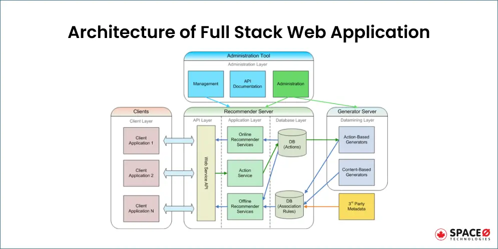
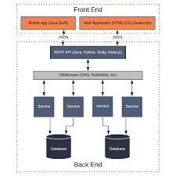

# Routing

Story begins with browser requesting URL

The server handles routing by receiving incoming HTTP requests from clients 
* analyzing the request
* Determining the response

Routing maps URLs and HTTP methods to handler functions that decide to do with each request. These handler functions process the request and generate a response, which can be dynamically generated content (like JSON data or rendered HTML) or instructions to serve a static asset (like a CSS file, image, or pre-existing HTML file).

There are 3 ways to handle routing: 

Traditional 
- initial page load: server generates entire HTML for page. 
- Nav: each navigation is a full HTTP request to server, whihc generates and sends a complete new page for each request. 
- SEO - good
- Performance: initial load slow, subsequent slow
- Server load: higher. 

Client-side routing
- initial page load: server sends minimal HTML, then JS takes over
- Navigation: JS updates URL / content without server requests (except API calls).
- SEO - requires special handling
- Performance: slower initial load, faster subsequent navigation
- Server load: lower after initial load
- data requests: server

* initial load is slow, SEO tricky, but after loads are faster. 
updating the URL (History API) and changing the content displayed within the existing page.  

Hybrid (NextJS) - 

- initial page load: server sends fully rendered HTML(SSR)  or pre-rendered static HTML (SSG).
- Navigation: JS updates URL / content, usually without full page reloads, but may pre-fetch data from the server in the background 
- SEO: much better
- Performance: faster initial, fast subsequent
- Server load: higher (for SSR).
- API requests: server

* fast initial load, fast subsequent nav, good SEO.

[https://www.lucidchart.com/blog/templates-for-back-end-engineers](https://www.lucidchart.com/blog/templates-for-back-end-engineers)

