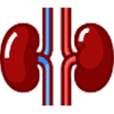
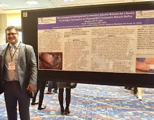
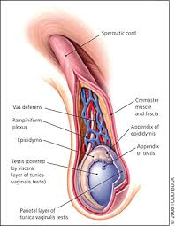
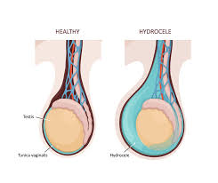

# It is important to understand that a suddenly retracted or contracted…

It is important to understand that a suddenly retracted or contracted testicle in a 55-year-old man, especially if it has been occurring in various forms for a month, warrants prompt medical evaluation. While some instances of testicular retraction are due to a normal muscle reflex, other more serious conditions should be ruled out. 
Possible causes of testicular retraction in adults include: 
* Hyperactive cremaster muscle reflex: The cremaster muscle contracts involuntarily, pulling the testicle towards the body. This can occur in response to cold temperatures, fear, emotional stress, or physical activity, such as intercourse or exercise. A hyperactive reflex can cause vigorous testicular retraction, sometimes requiring manual repositioning.
* Other underlying medical conditions:
	* Testicular torsion: This is a medical emergency where the testicle twists, cutting off blood supply. It causes sudden and severe pain and swelling.
	* Orchitis: Inflammation of the testicle, often caused by bacterial or viral infections.
	* Epididymitis: Inflammation of the epididymis, a coiled tube at the back of the testicle.
	* Varicocele: Enlarged veins in the scrotum.
	* Inguinal hernia: A portion of the intestine or fatty tissue pushing through a weak spot in the abdominal muscles.
	* Testicular cancer:Although rare, testicular cancer can cause changes in the testicle. 
Given the sustained and varied nature of the retraction experienced over a month, it is crucial to consult a healthcare professional for a proper diagnosis and appropriate management plan. 
Important Note: The information provided here is for general knowledge and informational purposes only, and does not constitute medical advice. It is essential to consult with a qualified healthcare professional for any concerns about testicular health or any other medical condition. They can perform a proper evaluation and provide guidance based on the specific situation. 

This is for informational purposes only. For medical advice or diagnosis, consult a professional. AI responses may include mistakes. <u>[Learn more](https://support.google.com/websearch?p=aimode)</u>

Retractile Testicles: Symptoms, Diagnosis, Causes & Treatment

Tua Saúde

Retractile Testis: What is it, Causes, Diagnosis and Treatment

Prof.Dr. Emin ÖZBEK

Treatment for adults with retractile testicles causing discomfort - Austin Vasectomy Center

Austin Vasectomy Center

Show all

13 sites

Evaluation of Scrotal Masses | AAFP

American Academy of Family Physicians | AAFP

Epididymitis - Penn Medicine

Penn Medicine

Hydrocele - Symptoms and causes - Mayo Clinic

Mayo Clinic

Hydrocele in Adults: Symptoms, Causes, and Treatment - Patient.info

Patient.info

Retractile testicle - Symptoms and causes - Mayo Clinic

Mayo Clinic

See all
Your description of the symptoms, particularly the painless retraction and mild swelling consistent with fluid, points towards some specific possibilities, but it is crucial to reiterate the need for medical evaluation. Self-treating or delaying a diagnosis can be risky. 
Based on your new information, here are some conditions that could be contributing to your symptoms:
Potential Causes:
* Hydrocele: This is a common cause of painless scrotal swelling in adults, where fluid collects around the testicle. It can sometimes cause a feeling of heaviness. While often harmless, a hydrocele can sometimes be linked to other issues like infection or injury.
* Varicocele: Enlarged veins in the scrotum can lead to swelling and aching, though they are usually painless.
* Spermatocele/Epididymal Cyst:These are fluid-filled sacs that typically form near the epididymis and are often painless, although they can cause swelling or a feeling of heaviness.
* Hyperactive Cremaster Muscle Reflex: While often causing significant retraction and potentially requiring manual repositioning, a hyperactive cremaster muscle reflex is a normal reflex that can lead to testicular retraction.
* Epididymitis: Inflammation of the epididymis can cause pain and swelling, which may become more noticeable with massage. 
Important Considerations:
* Pain after Massage: The aching after massage might indicate inflammation or irritation, making it important to get checked out.
* Varied Presentation: The fact that it's been like this in various forms for a month emphasizes the need for a professional diagnosis to rule out any underlying problems. 
Recommendation:
The best course of action is to consult a healthcare professional, such as a urologist, for a proper diagnosis and appropriate management plan. They can perform a physical examination, potentially order imaging tests like an ultrasound, and determine the cause of your symptoms. They can then provide specific treatment options tailored to your situation. 
Again, this information is for general knowledge and should not replace professional medical advice. 

This is for informational purposes only. For medical advice or diagnosis, consult a professional. AI responses may include mistakes. <u>[Learn more](https://support.google.com/websearch?p=aimode)</u>

Evaluation of Scrotal Masses | AAFP

American Academy of Family Physicians | AAFP

Epididymitis - Penn Medicine

Penn Medicine

Hydrocele - Symptoms and causes - Mayo Clinic

Mayo Clinic

Show all

10 sites

Retractile Testicle: Causes, Diagnosis & Treatment - Cleveland Clinic

Cleveland Clinic

Hydrocele: Causes, Symptoms, and Treatment - Healthline

Healthline

Understanding Hydrocele: Diagnosis and Management

Aurora Health Care

Hydrocele: Causes, Symptoms and Treatment - Advocate Health Care

Advocate Health

Hydrocele Repair | Johns Hopkins Medicine

Johns Hopkins Medicine

See all
For the conditions you described, such as a retracted testicle and mild swelling potentially indicating a hydrocele, whether they will heal on their own depends on the underlying cause. 
In the case of a retractile testicle caused by a hyperactive cremaster muscle reflex, it's generally considered harmless and often resolves on its own, especially in younger individuals. In fact, these types of testicles don't usually require treatment and may go away by puberty. 
However, the situation is different with a hydrocele, which is a fluid-filled sac around the testicle. While hydroceles in infants often disappear within the first year, hydroceles in adults may persist and require medical attention. Some hydroceles in adults may resolve, particularly if they are caused by a treated injury or infection. But if they are large, or if it is suspected to be a communicating hydrocele (where fluid flows between the abdomen and scrotum), surgical repair may be necessary. In adults, if a hydrocele hasn't gone away on its own after about 6 months, it's advisable to see a doctor. 
Therefore, while a retractile testicle due to a hyperactive reflex may resolve on its own, a hydrocele, especially in an adult, may not, and it's essential to seek medical evaluation for both to determine the specific cause and discuss the best course of action. A healthcare professional can accurately diagnose the condition and recommend appropriate treatment if needed, such as monitoring, medication, or surgery. Remember, it's always best to consult with a medical professional for any concerns about your health, especially when dealing with testicular issues. 

This is for informational purposes only. For medical advice or diagnosis, consult a professional. AI responses may include mistakes. <u>[Learn more](https://support.google.com/websearch?p=aimode)</u>