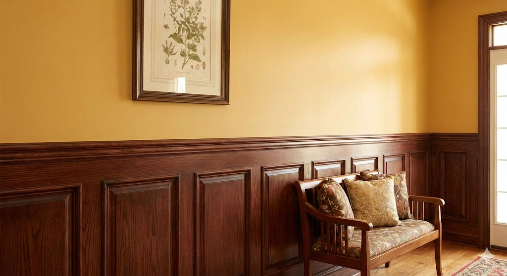

# Fina shelves + kitchen wall

 Shelves 
* what kind: pine, oak, walnut? 
* Staining will not be a great imitation. 
* Walnut can be 7-8 times more than pine
* Pine plan: 25x12 
* Walnut: 100x12
Measuring

67” wide x 9
Includes floor and ceiling 
Intervals 12.5” and 9.25”
11.5” and 10.25”
12” adn 9.75”

Vertical planks: 4 x 96”

Horizontal shelf supports? May need extra wood

Frame front: 

Wainscoting
* kind? [https://www.homedepot.com/p/HOUSE-OF-FARA-8-lin-ft-Red-Oak-Tongue-and-Groove-Wainscot-Paneling-32OKIT/100484657](https://www.homedepot.com/p/HOUSE-OF-FARA-8-lin-ft-Red-Oak-Tongue-and-Groove-Wainscot-Paneling-32OKIT/100484657)Measure?

Paint? 
* w/s
* Walls? 
* Cabinets? 

