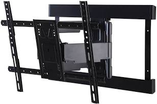
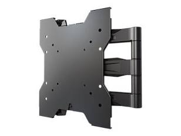

# TV Mount Research

1\11 BEST BUY [SANUS ELITE TV Mount ](https://www.bestbuy.com/product/sanus-elite-advanced-full-motion-4d-shift-tv-wall-mount-for-tvs-32-65-up-to-70-lbs-shifts-up-to-6-for-perfect-placement-black/J33JYHR6GR/sku/6571904)

Due to the height of the TV, to avoid neck strain we should recline while watching and also purchase a [full motion and tilt mount ](https://www.google.com/search?q=full+motion+tilt+and+swivel+tv+mount&oq=full+motion+and+tilt+&gs_lcrp=EgZjaHJvbWUqCAgBEAAYFhgeMgYIABBFGDkyCAgBEAAYFhgeMggIAhAAGBYYHjIICAMQABgWGB4yCAgEEAAYFhgeMggIBRAAGBYYHjIICAYQABgWGB4yCAgHEAAYFhgeMggICBAAGBYYHjIICAkQABgWGB7SAQg5MTcyajBqOagCBrACAfEFrxa_3PKywjM&sourceid=chrome&ie=UTF-8)

For size, Aim for a TV that’s 2/3 to 3/4 the width of the space above your fireplace.

Width of Pine mantel —— 52 inches (add 8.5-9 inches for full wall width … but I think centering over mantel wood makes sense)

2/3 of width = 34.67 inches
3/4 of width = 39 inches

Some say viewing from a tilt can reduce quality. AI says we need an OLED TV to compensate (see below). [Best Buy only as 42” OLEDs](https://www.bestbuy.com/site/searchpage.jsp?id=pcat17071&qp=parent_tvscreensizeplus_facet%3DTV+Screen+Size%7E33%22+-+44%22&st=OLED+TV) as the smallest size. Not a huge difference but on the bigger side for that space. Although if you take into account the added width of the full wall, 42” would probably be fine. 3/4 of the full 60” is 45” so - the 42” is within the recommended range for size.

OH!! 42” is actually the size we have right now now … so maybe looking around for a 36” - 39” makes sense. Or we could just use the current TV for a while until we know for sure 42” feels too big, then swap it out. 

The[ LG website ](https://www.lg.com/us/oled-tvs?gclsrc=aw.ds&gad_source=1&gad_campaignid=22304676932&gbraid=0AAAAADRIrHNHzr9G5NkkRkAOFb-H-PSsY&gclid=Cj0KCQiAsNPKBhCqARIsACm01fRPo6EJEaYvJMr_MqoiJcaBWxlzXPrt1OwEDGfsyr5yhlKgD2Enx3UaAvy5EALw_wcB)mentions free delivery and free in-home mounting with purchase — they have 38” OLEDs. Worth checking out.

They are expensive (likely $1000K or so, but we can look for financing if it’s 0% for any amount of time). Mounts are cheap but I would ask someone else to mount it please -  watched a vid on it and just seems like easier if someone else got the measurements right.

Yes, tilting a TV downward from above a mantel *can* degrade picture quality (washed-out colors, less contrast) because you're viewing it off-center, but using the right TV (OLEDs are great for angles) and an adjustable mount (full-motion or mantle mount) minimizes this significantly, aiming for under 15-20 degrees of tilt for best results. 

## **Why it's a problem**
* <u>**[Off-Axis Viewing](https://www.google.com/search?q=Off-Axis+Viewing&oq=Best+TV+for+tilted+viewing+-+is+it+true+you+won%27t+get+good+quality+if+the+screen+is+tilted+downward+from+above+a+mantel&gs_lcrp=EgZjaHJvbWUyBggAEEUYOdIBCTE5NTA4ajBqNKgCALACAfEFwoAY-FSND-A&sourceid=chrome&ie=UTF-8&mstk=AUtExfDLrqzJHksrw5i8svN5e9Zl505rCkcFqhJJ80bHtDp_gZaXrsitoco5In8tzKy9ZzZbb2Qv18vKokkQO1fNrHleBigboqpOQeSwuda8s3ATtLTBYB_3aqAIZW5fAGA-uTmaLTB24gZeTJ0c8WDnXFvjDzUBwlaBNgwynUi8FsD2gTkHCBRIr6i1Q6IUIGz1RdSEFwB5jSR8c3xDEg3jhTzxidSXcroQcr0DamkvyMv_JJjmNt8YTSw3JEzf1thdP0NqOf5bOfN0LAUKRWrO5SQEMLqWwkFPMgtGbZlkkAV0Ag&csui=3&ved=2ahUKEwj3mrCa2uiRAxWjk2oFHe3KNFkQgK4QegQIAxAB)**</u>**:** Most TVs look best when viewed head-on. Looking up at a tilted screen causes light to scatter, reducing brightness and washing out colors, especially on standard LCDs. 

## **Solutions for better quality**
1. <u>**[OLED TVs](https://www.google.com/search?q=OLED+TVs&oq=Best+TV+for+tilted+viewing+-+is+it+true+you+won%27t+get+good+quality+if+the+screen+is+tilted+downward+from+above+a+mantel&gs_lcrp=EgZjaHJvbWUyBggAEEUYOdIBCTE5NTA4ajBqNKgCALACAfEFwoAY-FSND-A&sourceid=chrome&ie=UTF-8&mstk=AUtExfDLrqzJHksrw5i8svN5e9Zl505rCkcFqhJJ80bHtDp_gZaXrsitoco5In8tzKy9ZzZbb2Qv18vKokkQO1fNrHleBigboqpOQeSwuda8s3ATtLTBYB_3aqAIZW5fAGA-uTmaLTB24gZeTJ0c8WDnXFvjDzUBwlaBNgwynUi8FsD2gTkHCBRIr6i1Q6IUIGz1RdSEFwB5jSR8c3xDEg3jhTzxidSXcroQcr0DamkvyMv_JJjmNt8YTSw3JEzf1thdP0NqOf5bOfN0LAUKRWrO5SQEMLqWwkFPMgtGbZlkkAV0Ag&csui=3&ved=2ahUKEwj3mrCa2uiRAxWjk2oFHe3KNFkQgK4QegQIBRAB)**</u>**:** OLEDs (like LG, Sony, Samsung) offer nearly perfect viewing angles, making them ideal for high mounting where tilt is necessary.
4. <u>**[Full-Motion Mounts](https://www.google.com/search?q=Full-Motion+Mounts&oq=Best+TV+for+tilted+viewing+-+is+it+true+you+won%27t+get+good+quality+if+the+screen+is+tilted+downward+from+above+a+mantel&gs_lcrp=EgZjaHJvbWUyBggAEEUYOdIBCTE5NTA4ajBqNKgCALACAfEFwoAY-FSND-A&sourceid=chrome&ie=UTF-8&mstk=AUtExfDLrqzJHksrw5i8svN5e9Zl505rCkcFqhJJ80bHtDp_gZaXrsitoco5In8tzKy9ZzZbb2Qv18vKokkQO1fNrHleBigboqpOQeSwuda8s3ATtLTBYB_3aqAIZW5fAGA-uTmaLTB24gZeTJ0c8WDnXFvjDzUBwlaBNgwynUi8FsD2gTkHCBRIr6i1Q6IUIGz1RdSEFwB5jSR8c3xDEg3jhTzxidSXcroQcr0DamkvyMv_JJjmNt8YTSw3JEzf1thdP0NqOf5bOfN0LAUKRWrO5SQEMLqWwkFPMgtGbZlkkAV0Ag&csui=3&ved=2ahUKEwj3mrCa2uiRAxWjk2oFHe3KNFkQgK4QegQIBRAD)**</u> **(Mantle Mounts):** These allow you to pull the TV down and tilt it to eye level when watching, then push it back up. This is the best solution for minimizing picture quality loss and neck strain.
7. <u>**[Tilt Mounts](https://www.google.com/search?q=Tilt+Mounts&oq=Best+TV+for+tilted+viewing+-+is+it+true+you+won%27t+get+good+quality+if+the+screen+is+tilted+downward+from+above+a+mantel&gs_lcrp=EgZjaHJvbWUyBggAEEUYOdIBCTE5NTA4ajBqNKgCALACAfEFwoAY-FSND-A&sourceid=chrome&ie=UTF-8&mstk=AUtExfDLrqzJHksrw5i8svN5e9Zl505rCkcFqhJJ80bHtDp_gZaXrsitoco5In8tzKy9ZzZbb2Qv18vKokkQO1fNrHleBigboqpOQeSwuda8s3ATtLTBYB_3aqAIZW5fAGA-uTmaLTB24gZeTJ0c8WDnXFvjDzUBwlaBNgwynUi8FsD2gTkHCBRIr6i1Q6IUIGz1RdSEFwB5jSR8c3xDEg3jhTzxidSXcroQcr0DamkvyMv_JJjmNt8YTSw3JEzf1thdP0NqOf5bOfN0LAUKRWrO5SQEMLqWwkFPMgtGbZlkkAV0Ag&csui=3&ved=2ahUKEwj3mrCa2uiRAxWjk2oFHe3KNFkQgK4QegQIBRAF)**</u>**:** If full-motion isn't an option, a simple tilt mount helps, but it's a compromise. Aim for a downward angle of 10-15 degrees, not more.
10. <u>**[The Frame TVs](https://www.google.com/search?q=The+Frame+TVs&oq=Best+TV+for+tilted+viewing+-+is+it+true+you+won%27t+get+good+quality+if+the+screen+is+tilted+downward+from+above+a+mantel&gs_lcrp=EgZjaHJvbWUyBggAEEUYOdIBCTE5NTA4ajBqNKgCALACAfEFwoAY-FSND-A&sourceid=chrome&ie=UTF-8&mstk=AUtExfDLrqzJHksrw5i8svN5e9Zl505rCkcFqhJJ80bHtDp_gZaXrsitoco5In8tzKy9ZzZbb2Qv18vKokkQO1fNrHleBigboqpOQeSwuda8s3ATtLTBYB_3aqAIZW5fAGA-uTmaLTB24gZeTJ0c8WDnXFvjDzUBwlaBNgwynUi8FsD2gTkHCBRIr6i1Q6IUIGz1RdSEFwB5jSR8c3xDEg3jhTzxidSXcroQcr0DamkvyMv_JJjmNt8YTSw3JEzf1thdP0NqOf5bOfN0LAUKRWrO5SQEMLqWwkFPMgtGbZlkkAV0Ag&csui=3&ved=2ahUKEwj3mrCa2uiRAxWjk2oFHe3KNFkQgK4QegQIBRAH)**</u>**:** Samsung's The Frame is popular for its aesthetics and offers good viewing angles for its category. 

<u>**TV**</u> <u>**Mount**</u><u>**s**</u>

For a 42" TV, achieving a **20-degree viewing angle** requires a full-motion (articulating) mount, not just a tilting one. The best quality mounts combine sturdy construction with a minimal profile when retracted.

## **Best Low-Profile Full-Motion Mounts**

<u>[Sanus Elite Super Slim Full-Motion TV Wall Mount](https://www.google.com/search?ibp=oshop&prds=pvt:hg,pvo:29,mid:576462704737401021,imageDocid:12151819510689970067,gpcid:11516532182487694341,headlineOfferDocid:11680634047189657029,catalogid:5754242209273031157,productDocid:12051538914562032549,rds:PC_11516532182487694341%7CPROD_PC_11516532182487694341&q=product&sa=X&ved=2ahUKEwj-wJiK4OuRAxUvkYkEHaglFjcQgLcPegYIAQgEEAE)</u>[$224.99](https://www.google.com/search?ibp=oshop&prds=pvt:hg,pvo:29,mid:576462704737401021,imageDocid:12151819510689970067,gpcid:11516532182487694341,headlineOfferDocid:11680634047189657029,catalogid:5754242209273031157,productDocid:12051538914562032549,rds:PC_11516532182487694341%7CPROD_PC_11516532182487694341&q=product&sa=X&ved=2ahUKEwj-wJiK4OuRAxUvkYkEHaglFjcQgLcPegYIAQgEEAE)~~[$299.99](https://www.google.com/search?ibp=oshop&prds=pvt:hg,pvo:29,mid:576462704737401021,imageDocid:12151819510689970067,gpcid:11516532182487694341,headlineOfferDocid:11680634047189657029,catalogid:5754242209273031157,productDocid:12051538914562032549,rds:PC_11516532182487694341%7CPROD_PC_11516532182487694341&q=product&sa=X&ved=2ahUKEwj-wJiK4OuRAxUvkYkEHaglFjcQgLcPegYIAQgEEAE)~~[Best Buy& more
4.7

(431)
](https://www.google.com/search?ibp=oshop&prds=pvt:hg,pvo:29,mid:576462704737401021,imageDocid:12151819510689970067,gpcid:11516532182487694341,headlineOfferDocid:11680634047189657029,catalogid:5754242209273031157,productDocid:12051538914562032549,rds:PC_11516532182487694341%7CPROD_PC_11516532182487694341&q=product&sa=X&ved=2ahUKEwj-wJiK4OuRAxUvkYkEHaglFjcQgLcPegYIAQgEEAE)

* **Low Profile:** Sits only **1.6 inches** from the wall when fully retracted, creating a sleek, flush look. This is one of the slimmest available for full-motion capabilities.
* **Sturdiness:** Features a solid steel frame and is UL Certified to support maximum loads, ensuring stability and safety. Reviewers praise its "unparalleled smoothness" due to the FluidMotion™ design.
* **Viewing Angle (Swivel):** Extends up to **20 inches**, which allows the 42" TV to swivel more than enough to reach a 20-degree angle for far-side seating, possibly up to 90 degrees depending on wall position.
* **Tilting:** Offers fingertip tilt adjustment for optimal vertical angle and glare reduction.
<u>[Crimson AU42 World's Thinnest Articulating Mount](https://www.google.com/search?ibp=oshop&prds=pvt:hg,pvo:29,mid:576462601379890677,imageDocid:17250791585424003372,gpcid:1633286326434004542,headlineOfferDocid:4921293831353064280,catalogid:12410882649016018488,productDocid:3290288194543712217,rds:PC_1633286326434004542%7CPROD_PC_1633286326434004542&q=product&sa=X&ved=2ahUKEwj-wJiK4OuRAxUvkYkEHaglFjcQgLcPegYIAQgEEA4)</u>[$209.95](https://www.google.com/search?ibp=oshop&prds=pvt:hg,pvo:29,mid:576462601379890677,imageDocid:17250791585424003372,gpcid:1633286326434004542,headlineOfferDocid:4921293831353064280,catalogid:12410882649016018488,productDocid:3290288194543712217,rds:PC_1633286326434004542%7CPROD_PC_1633286326434004542&q=product&sa=X&ved=2ahUKEwj-wJiK4OuRAxUvkYkEHaglFjcQgLcPegYIAQgEEA4)~~[$276.00](https://www.google.com/search?ibp=oshop&prds=pvt:hg,pvo:29,mid:576462601379890677,imageDocid:17250791585424003372,gpcid:1633286326434004542,headlineOfferDocid:4921293831353064280,catalogid:12410882649016018488,productDocid:3290288194543712217,rds:PC_1633286326434004542%7CPROD_PC_1633286326434004542&q=product&sa=X&ved=2ahUKEwj-wJiK4OuRAxUvkYkEHaglFjcQgLcPegYIAQgEEA4)~~[
StandsandMounts.com& more
4.7

(6)
](https://www.google.com/search?ibp=oshop&prds=pvt:hg,pvo:29,mid:576462601379890677,imageDocid:17250791585424003372,gpcid:1633286326434004542,headlineOfferDocid:4921293831353064280,catalogid:12410882649016018488,productDocid:3290288194543712217,rds:PC_1633286326434004542%7CPROD_PC_1633286326434004542&q=product&sa=X&ved=2ahUKEwj-wJiK4OuRAxUvkYkEHaglFjcQgLcPegYIAQgEEA4)

* **Low Profile:** This mount holds the flat panel display a mere **1.09 inches** from the wall when retracted, making it arguably the thinnest on the market with articulating features.
* **Sturdiness:** Made from high-grade cold rolled steel and aluminum, designed to hold up to 79.4 lbs.
* **Viewing Angle (Swivel):** Extends up to **20 inches** and offers up to 180° of swivel for maximum viewing flexibility.
* **Tilting:** Provides a tilt range of +15° forward and -5° back. 

## **Why You Need an Articulating Mount**
A standard tilting mount only moves vertically (up and down) to adjust for glare, but it does not allow the TV to turn horizontally (side-to-side) towards off-center seating. To achieve your required **20-degree viewing angle** from a side position, the mount must be able to swivel, which requires an articulating (full-motion) arm to extend the TV away from the wall before angling. The models listed above are specifically designed to meet this need while minimizing the profile when pushed back
